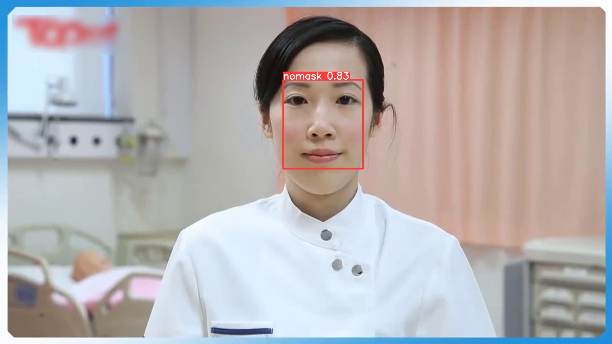

# Mask/No Mask Wearing Detection and Optimization with YOLOv5

----



## Introduction

Learning to build a project, including: 

- Using [YOLOv5](https://github.com/ultralytics/yolov5.git) to detect mask wearing.
- Using [tensorrtx](https://github.com/wang-xinyu/tensorrtx.git) to optimize the model.
- Using `flask` to display the results.


## Version

`YOLOv5-5.0`

`TensorRT 7.2.2.3`

## Training

- Release resources in

## Setup & Environments

`Intel E5 *5 Cores` +`GTX 1050Ti / TITAN X`

`Ubuntu 18.04`  + `CUDA 11.0 ` + `CUDNN 8`

`Python 3.8 `  + `Pytorch 1.7.1 `


## Validation

YOLOv5 benchmark:

```bash
python val.py --data ./voc-mask.yaml --weights weights/yolov5s_best.pt --batch-size 16
```

Flask Deployment:

- Install Flask
- Run Flask：`sh run.sh`
- Access `127.0.0.1:8888`


## References

[YOLOv5](https://github.com/ultralytics/yolov5.git)

[tensorrtx](https://github.com/wang-xinyu/tensorrtx.git)

